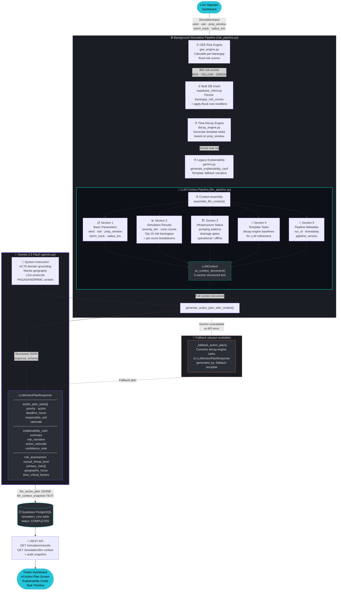

# ACTA — Context-Aware Decision-to-Action Simulation Engine

> An AI-powered disaster preparedness simulation platform generating time-decayed, spatially-aware action plans for Manila LGU operators.

---
### 🌐 Live Deployment
The platform is fully deployed and available for use here:
👉 **[Launch ACTA Simulation Engine](https://sisig-mayo.github.io/ACTA/)**

## Architecture Overview

```
┌─────────────────────────────────────────────────────────────┐
│                      ACTA Monorepo                          │
├──────────────┬──────────────────┬────────────────────────────┤
│  database/   │    backend/      │   frontend/ (lib/)         │
│  PostgreSQL  │    FastAPI       │   Flutter Web/Mobile       │
│  PostGIS     │    Python 3.11+  │   Riverpod + FlutterMap    │
│  pgRouting   │    Gemini AI     │   Responsive Dashboard     │
└──────────────┴──────────────────┴────────────────────────────┘
```

---

## What ACTA Does

ACTA supports a Manila LGU flood preparedness workflow:

- Monitor operational context in a Command Center with barangay risk maps,
  alerts, priority areas, and resource summaries.
- Configure hydrologic flood simulations with wind, rainfall, preparation
  window, and storm track assumptions. The backend also supports an impact
  radius parameter.
- Run simulations asynchronously through FastAPI and store status/results in
  Supabase.
- Score barangays into green, yellow, and red risk zones.
- Generate time-decayed response tasks based on the remaining preparation
  window.
- Continue prototype walkthroughs with a local **Use Demo Result** fallback when
  external services are unavailable.
- Produce Gemini-assisted action plans with explainability cards and an
  auditable LLM context snapshot, with deterministic fallback output when Gemini
  is unavailable.
- Review, approve, export, and dispatch a Master Action Plan PDF.
- Query flood-aware routing and barangay boundaries through backend APIs.

Current improvement targets are documented in
`docs/docs/product/features.md`. The main gaps are live resource inventory,
accurate result centroids, fuller routing UI integration, dispatch audit history,
and either implementing or hiding non-flood hazard profiles until they have
dedicated backend models.

---

## LLM Pipeline Architecture

The LLM pipeline assembles all available basic parameters and simulation data into a structured context document, which is fed to Gemini AI with a domain-specific system prompt to produce a fully context-aware disaster response action plan.



### Context Sections Fed to Gemini

| # | Section | Source | Key Data |
|---|---------|--------|---------|
| 1 | **Basic Parameters** | `SimulationInput` | wind speed, precipitation, prep window, storm track |
| 2 | **Simulation Results** | GEE engine | severity tier, zone counts, top-15 risk barangays with score breakdowns |
| 3 | **Infrastructure Status** | `infrastructure_status` table | pumping stations & drainage gates, operational/offline state |
| 4 | **Template Tasks** | `decay_engine.py` | time-decayed baseline tasks for LLM refinement |
| 5 | **Metadata** | Pipeline | run ID, pipeline version, timestamps |

### Key Files

| File | Role |
|------|------|
| `backend/app/models/llm_models.py` | `LLMContext`, `LLMActionPlanResponse` Pydantic schemas |
| `backend/app/core/gemini.py` | System instruction + `generate_action_plan_with_context()` |
| `backend/app/services/llm_pipeline.py` | 5-stage context assembly orchestrator |
| `backend/app/services/risk_pipeline.py` | Integrates LLM stage into simulation background task |
| `backend/app/routes/simulation.py` | `GET /api/v1/simulation/llm-context/{run_id}` audit endpoint |
| `database/migrations/007_llm_pipeline_columns.sql` | Adds `llm_action_plan` + `llm_context_snapshot` columns |


## Branch Strategy

| Branch | Purpose | Owner |
|---|---|---|
| `main` | Production-stable release state | Release Engineer |
| `develop` | Integration branch for daily development | All |
| `feature/spatial-db` | PostGIS extensions, migrations, GeoJSON parsing | DB Engineer |
| `feature/backend-decay` | FastAPI routing, time-decay planning service | Backend Engineer |
| `feature/frontend-dashboard` | Flutter UI, state adapters, mapping canvases | Frontend Engineer |

### Workflow

```
feature/* ──► develop ──► main
              (PR + review)  (tagged release)
```

## Commit Conventions

All commits **must** follow Conventional Commits (`type(scope): message`):

```
feat(db): add 001 spatial extensions and barangay schemas
feat(backend): implement async endpoints and proximity time decay service logic
feat(frontend): build responsive layout controls and map visualization canvas stubs
fix(backend): correct flood zone geometry intersection threshold
chore(repo): update dependencies and environment template
```

## Documentation

The maintained documentation lives in the `docs/` folder:

- `docs/docs/` contains the editable Markdown pages.
- `docs/mkdocs.yml` defines the documentation navigation and theme.
- `docs/site/` is the generated static website output from MkDocs.

To view the documentation locally:

```bash
cd docs
python -m pip install mkdocs
mkdocs serve
```

Then open the local URL printed by MkDocs, usually
`http://127.0.0.1:8000/`.

To check the docs before committing:

```bash
cd docs
mkdocs build --strict
```

### Deploying The Documentation Website

The docs can be deployed as a static website because MkDocs builds plain HTML,
CSS, and JavaScript into `docs/site/`.

Recommended process:

1. Choose one canonical production site. This should be the main public
   documentation website for ACTA.
2. Treat any other deployments as previews, staging builds, or old experiments.
   If there are many deployments, label them clearly and keep only one linked as
   the main website.
3. Build the site locally:

   ```bash
   cd docs
   mkdocs build --strict
   ```

4. Deploy the generated `docs/site/` folder to a static host such as GitHub
   Pages, Netlify, Vercel, Cloudflare Pages, or Firebase Hosting.
5. After deployment, update this README with the final public documentation URL.

For GitHub Pages, the simplest manual deployment is:

```bash
cd docs
mkdocs gh-deploy --force
```

That publishes the built documentation to the repository's `gh-pages` branch.
In the repository settings, configure GitHub Pages to serve from that branch. If
the repository already has many Pages or hosting deployments, keep the ACTA docs
deployment as the single production docs site and archive or rename the rest as
preview/staging deployments.

## Quick Start

### 1. Environment Setup

```bash
cp .env.example .env
# Populate .env with your actual keys
```

### 2. Database Migrations

Run migrations against your Supabase PostgreSQL instance:

```sql
-- Execute in order via Supabase SQL Editor or psql
\i database/migrations/001_extensions_and_tables.sql
\i database/migrations/002_routing_logic.sql
\i database/migrations/003_meteorological_data.sql
\i database/migrations/004_simulation_risk_tables.sql
\i database/migrations/005_dynamic_route_cost.sql
\i database/migrations/006_optimized_routing.sql
\i database/migrations/007_barangay_geojson_rpc.sql
\i database/migrations/007_llm_pipeline_columns.sql
```

> Note: the repository currently has two `007_*` migrations. Keep their
> execution order explicit until one file is renumbered.

### 3. Seed Barangay Data

```bash
# Place manila.geojson in data/raw/ (gitignored)
cd database
python seed_geojson_handler.py --file ../data/raw/manila.geojson
```

### 4. Backend

```bash
cd backend
python -m venv .venv
source .venv/bin/activate  # Windows: .venv\Scripts\activate
pip install -r requirements.txt
uvicorn main:app --reload --host 0.0.0.0 --port 8000
```

### 5. Frontend

```bash
# From repo root (Flutter project root)
flutter pub get
flutter run -d chrome  # or target device
```

The frontend defaults to the deployed ACTA backend. To target a local backend,
pass `ACTA_API_BASE_URL`:

```bash
flutter run -d chrome --dart-define=ACTA_API_BASE_URL=http://localhost:8000
```

## Directory Structure

```
├── .env.example
├── .gitignore
├── README.md
├── database/
│   ├── migrations/
│   │   ├── 001_extensions_and_tables.sql
│   │   └── 002_routing_logic.sql
│   └── seed_geojson_handler.py
├── backend/
│   ├── requirements.txt
│   ├── main.py
│   └── app/
│       ├── __init__.py
│       ├── core/
│       │   ├── config.py
│       │   └── gemini.py
│       ├── models/
│       │   ├── simulation.py
│       │   └── action_plan.py
│       ├── routes/
│       │   ├── simulation.py
│       │   └── routing.py
│       └── services/
│           ├── decay_engine.py
│           └── bypass_router.py
└── lib/                          # Flutter frontend
    ├── main.dart
    ├── models/
    │   └── simulation_models.dart
    └── views/
        ├── dashboard_screen.dart
        └── widgets/
            ├── control_panel.dart
            └── explainability_card.dart
```

## Spatial Data Contract

The system expects a local `manila.geojson` file containing MultiPolygon geometries for Manila's 505 barangays. This file is **gitignored** and must be placed in `data/raw/` manually.

**Required GeoJSON properties per feature:**
- `barangay_name` (string)
- `district` (string)
- `geometry` (MultiPolygon, EPSG:4326)

## License

Proprietary — All rights reserved.
